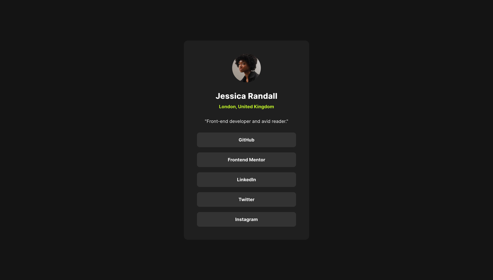

# Frontend Mentor - Social Link Profile solution

This is a solution to the [Social links profile challenge on Frontend Mentor](https://www.frontendmentor.io/challenges/social-links-profile-UG32l9m6dQ). Frontend Mentor challenges help you improve your coding skills by building realistic projects.

## Overview

### Screenshot

### Links

- [Solution URL](https://github.com/alexwilkom/blog-preview-card)
- [Live Site](https://alexwilkom.github.io/social-links-profile/)

## My process

### Built with

- CSS custom properties
- Used a normal flow layout for the card
- Media Queries
- Self hosting fonts

## Author

- GitHub - [Alex Wilkom](https://github.com/alexwilkom)
- Frontend Mentor - [@alexwilkom](https://www.frontendmentor.io/profile/alexwilkom)
